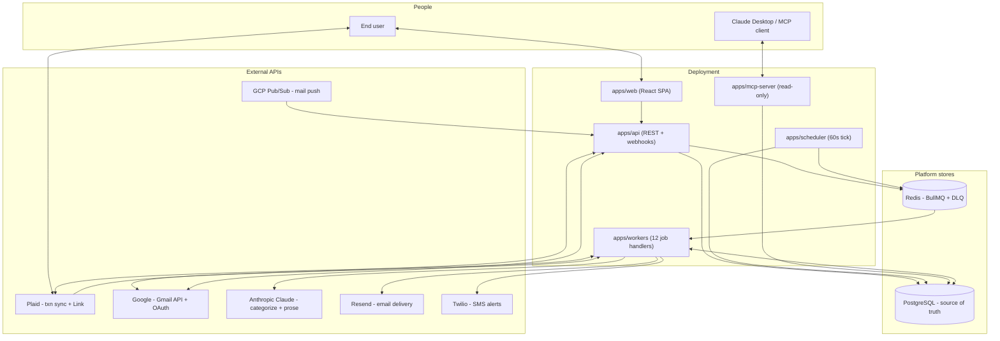
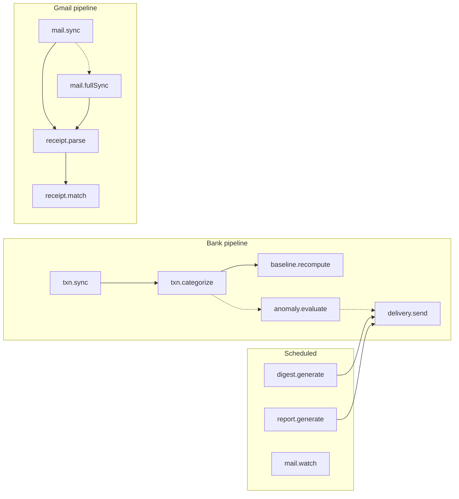

# Expense Digest Agent

[]()
[]()
[]()
[]()

A multi-tenant backend that connects to your **bank** (Plaid) and **Gmail**, understands your transactions and order emails, and sends a **proactive, human-readable weekly digest** — plus monthly expense reports and immediate alerts when something looks off (price hikes, duplicate charges, new subscriptions).

**The product is the narrative digest, not another dashboard.** Bank apps dump raw transactions at you — this turns them into a message that reads like someone who knows your finances.

---

## Quick start

```bash
# Prerequisites: Node ≥20, Docker + Docker Compose

git clone <repo> && cd expense-summary-agent
npm install
cp .env.example .env

# Start Postgres (port 5433) + Redis
npm run infra:up

# Create database tables
npm run db:migrate

# Run tests to verify everything works
npm test

# Start the backend (three terminals)
npm run dev:api         # REST + webhooks (port 3000)
npm run dev:workers     # Job consumers (all domain logic)
npm run dev:scheduler   # Digest scheduler (60s tick)
```

See [Running locally](#running-locally) for detailed process combinations.

---

## Features

1. **Bank ingest** — Plaid webhooks trigger cursor-based, idempotent transaction sync
2. **Gmail ingest** — Pub/Sub push → incremental mail sync; receipt emails parsed and stored
3. **Receipt matching** — Receipts linked to Plaid charges when confidence is high; unmatched items surfaced honestly
4. **Merchant enrichment** — 3-tier categorization: Plaid PFC → learned cache → Claude (cache miss only)
5. **Anomaly detection** — Deterministic detectors flag price increases, duplicate charges, new subscriptions, unusual spend
6. **Weekly digest** — Code computes `DigestFacts` (all numbers); Claude writes prose only; money-contract enforcer catches invented figures
7. **Monthly report** — Scheduled on 1st of each month for prior calendar month
8. **Delivery** — Resend email / Twilio SMS (dry-run in dev)
9. **MCP tools** — Claude Desktop queries per-user finances via 5 read-only tools

**Design philosophy:** Every external dependency (Plaid, Claude, Gmail, Resend, Twilio, Postgres, Redis) sits behind a typed port. Business logic lives in `@expense/core` and never imports an adapter. Swapping a vendor is a one-file change.

---

## Architecture

The system is **event-driven**: HTTP handlers and the scheduler enqueue jobs; **`apps/workers`** is the only process that runs domain services against the queue. Nothing on the ingress path blocks on vendors — it persists intent and returns.

### Processes

| Process | Command | Role | Queue |
|---------|---------|------|-------|
| `apps/api` | `npm run dev:api` | REST + Plaid/Gmail webhooks | Enqueues only (producer) |
| `apps/workers` | `npm run dev:workers` | 12 job handlers, domain services, LLM, delivery | Consumes all job types |
| `apps/scheduler` | `npm run dev:scheduler` | 60s tick: due digests, mail.watch renewal, monthly reports | Enqueues scheduled jobs |
| `apps/web` | `npm run dev:web` | React UI: onboarding, preferences, digest history | None |
| `apps/mcp-server` | `npm run dev:mcp` | stdio MCP, read-only Postgres queries | None |

### Data flow



### Job pipeline



### Job registry

| Job | Enqueued by | Service | External calls | May enqueue |
|-----|-------------|---------|----------------|-------------|
| `txn.sync` | API webhook/Link | syncService | Plaid `/transactions/sync` | `txn.categorize` |
| `txn.categorize` | workers | categorizeService | LLM on cache miss | `baseline.recompute`, `anomaly.evaluate` |
| `baseline.recompute` | workers | baselineService | — | — |
| `anomaly.evaluate` | workers | anomalyService | — | `delivery.send` (high severity) |
| `digest.generate` | scheduler | digestService | LLM for prose | `delivery.send` |
| `report.generate` | scheduler | reportService | LLM for prose | `delivery.send` |
| `delivery.send` | workers | deliveryService | Resend and/or Twilio | — |
| `mail.sync` | webhook/OAuth/scheduler | mailSyncService | Gmail history.list | `receipt.parse`, `mail.fullSync` |
| `mail.fullSync` | workers (on 404) | mailFullSyncService | Gmail messages.list | `receipt.parse` |
| `mail.watch` | scheduler | mailWatchService | Gmail users.watch | — |
| `receipt.parse` | workers | receiptParseService | Claude receipt extractor | `receipt.match` |
| `receipt.match` | workers | receiptMatchService | — (scoring only) | — |

**Idempotency keys:** `txn.sync:{itemId}`, `digest:{userId}:{isoWeek}`, `report:{userId}:{yearMonth}`, `mail.sync:{mailAccountId}`, `mail.watch:{mailAccountId}:{YYYY-MM-DD}`.

---

## Project structure

```
├── apps/
│   ├── api/              # REST + Plaid/Gmail webhooks (enqueue only)
│   ├── workers/          # BullMQ consumers → domain services
│   ├── scheduler/        # Per-user digest scheduler (60s tick)
│   ├── mcp-server/       # MCP tools for Claude Desktop
│   └── web/              # React UI
├── packages/
│   ├── core/             # Domain types, ports, services (no vendor imports)
│   ├── config/           # Env, layered YAML, crypto, loggers, JWT
│   ├── wiring/           # Shared composition builders
│   ├── db/               # Prisma + repository adapters
│   ├── queue/            # BullMQ producer/consumer, job schemas
│   ├── plaid/            # BankProvider adapter
│   ├── gmail/            # MailProvider adapter
│   ├── llm/              # Claude LlmProvider + receipt extractor
│   └── delivery/         # Resend + Twilio channels
├── config/               # default.yaml + env overlays (tunables)
├── test-scenarios/       # YAML e2e scenario files
├── scripts/              # Utility + demo scripts
└── docs/                 # Full design docs
```

Architecture doc: [`docs/expense-digest-architecture.md`](./docs/expense-digest-architecture.md)  
Code map: [`docs/code-map.md`](./docs/code-map.md)  
All interfaces: [`docs/interfaces.md`](./docs/interfaces.md)

---

## Running locally

### 1. Infrastructure

```bash
npm run infra:up         # Docker: Postgres (5433) + Redis (6379)
npm run db:migrate       # Prisma: create tables
```

### 2. Backend processes (separate terminals)

| To test | Required processes |
|---------|-------------------|
| Plaid webhook → sync → categorize → anomaly | `dev:api` + `dev:workers` + infra |
| Weekly digest delivery | above + `dev:scheduler` |
| Web UI | `dev:api` + `dev:web` |
| Gmail receipt match | above + `GOOGLE_*` / `GMAIL_*` env vars |
| MCP tools | `dev:mcp` + Postgres |

```bash
npm run dev:api         # port 3000
npm run dev:workers
npm run dev:scheduler
npm run dev:mcp         # needs MCP_ACCESS_TOKEN + Postgres
```

### 3. Frontend

Generate a user UUID, mint an auth token, and start the web UI:

```bash
USER_ID=$(node -e "process.stdout.write(crypto.randomUUID())")
TOKEN=$(npm run mint-api-token --silent -- --user-id=$USER_ID)
VITE_AUTH_TOKEN=$TOKEN npm run dev:web   # http://localhost:5173
```

The app loads at `http://localhost:5173` and calls `/api/setup/status` to
check account connections. You'll see the **Connect bank** and **Connect Gmail**
buttons — clicking them requires real Plaid/Google credentials (they'll 500
otherwise).

---

## Configuration

Two layers — **secrets in `.env`**, **tunables in YAML**:

| Layer | Location | Examples |
|-------|----------|----------|
| Secrets & connections | `.env` (Zod-validated) | `DATABASE_URL`, `PLAID_*`, `ANTHROPIC_API_KEY`, `AUTH_JWT_SECRET` |
| Application tunables | `config/*.yaml` (layered) | Worker concurrency, queue retries, scheduler tick, anomaly thresholds |

YAML merges `default.yaml` → `{NODE_ENV}.yaml`. See [`config/README.md`](./config/README.md).

Key env flags:

| Variable | Effect |
|----------|--------|
| `LLM_FAKE=true` | Deterministic fake LLM (no API key needed) |
| `DELIVERY_DRY_RUN=true` | Log instead of sending email/SMS |
| `ENCRYPTION_KEY` | Required for Postgres repos (Plaid tokens at rest) |
| `PLAID_*` | Real bank sync when set |
| `ANTHROPIC_API_KEY` + `LLM_FAKE=false` | Real Claude digests/categorization |
| `GOOGLE_*` / `GMAIL_*` | Gmail OAuth + Pub/Sub push |

---

## Tests

```bash
npm test                    # unit + component (320 tests, no infra)
npm run test:watch          # watch mode
npm run test:integration    # Postgres + Redis + vendor sandbox
npm run typecheck           # backend + web TypeScript
```

| Suite | Count | Needs |
|-------|-------|-------|
| Unit + component | 320 | Nothing |
| Integration | 30 | Docker Postgres + Redis |
| Vendor sandbox | 30 skipped without keys | Plaid, Claude, Gmail, Resend, Twilio keys |

E2e heartbeats:
- `webhook-to-digest.e2e.ts` — full pipeline → digest delivered
- `gmail-to-digest.e2e.ts` — Plaid + Gmail receipt match
- `scenario-runner.e2e.ts` — multi-user YAML demo runner

```bash
npm run scenario            # Multi-user pipeline demo (verbose output)
```

---

## MCP server

Expose 5 read-only tools for Claude Desktop:

- `get_spending_this_week`
- `compare_to_last_month`
- `get_spending_by_category`
- `list_recent_anomalies`
- `get_digest_history`

Each tool is tenant-scoped to a single user via a short-lived JWT.

```bash
# Mint a token for a user
npm run mint-mcp-token -- --user-id=USER_ID

# Configure Cursor/Claude Desktop to run:
#   npx tsx apps/mcp-server/src/main.ts
# With env: MCP_ACCESS_TOKEN=<minted-token>
```

See [`.cursor/mcp.json`](./.cursor/mcp.json) for a Cursor example config.

---

## OAuth flows

**Plaid:** Frontend calls `POST /api/plaid/link-token` → opens Plaid Link popup → user logs in at bank → Plaid returns `publicToken` → `POST /api/plaid/exchange` stores encrypted token → enqueues `txn.sync`.

**Gmail:** Frontend redirects to `GET /api/gmail/authorize` → Google SSO → callback at `/api/gmail/callback` stores tokens, sets up PubSub watching → enqueues `mail.sync`.

Both require the web frontend to kick off the popup. API routes handle the OAuth/callback.

---

## Documentation

| Doc | Purpose |
|-----|---------|
| [`docs/README.md`](./docs/README.md) | Index + docs-first methodology |
| [`docs/expense-digest-architecture.md`](./docs/expense-digest-architecture.md) | Full product + system design |
| [`docs/interfaces.md`](./docs/interfaces.md) | Every port, specified with contracts |
| [`docs/conventions.md`](./docs/conventions.md) | Money, ids, time, errors |
| [`docs/code-map.md`](./docs/code-map.md) | File-by-file map |
| [`docs/gmail-receipt-enrichment.md`](./docs/gmail-receipt-enrichment.md) | Gmail connect, receipt match, monthly reports |
| [`docs/error-handling.md`](./docs/error-handling.md) | Error taxonomy + retry/DLQ |
| [`docs/testing.md`](./docs/testing.md) | Testing philosophy + fakes |
| [`docs/execution-plan.md`](./docs/execution-plan.md) | Build sequence (all phases complete) |

---

## Stack

| Layer | Choice |
|-------|--------|
| Runtime | TypeScript, Node.js ≥ 20 |
| Monorepo | npm workspaces |
| Database | PostgreSQL + Prisma |
| Queue | BullMQ over Redis |
| Bank | Plaid |
| LLM | Anthropic Claude |
| Email | Resend |
| SMS | Twilio |
| Frontend | Vite + React |
| MCP | `@modelcontextprotocol/sdk` |
| Tests | Vitest |

---

## License

MIT
