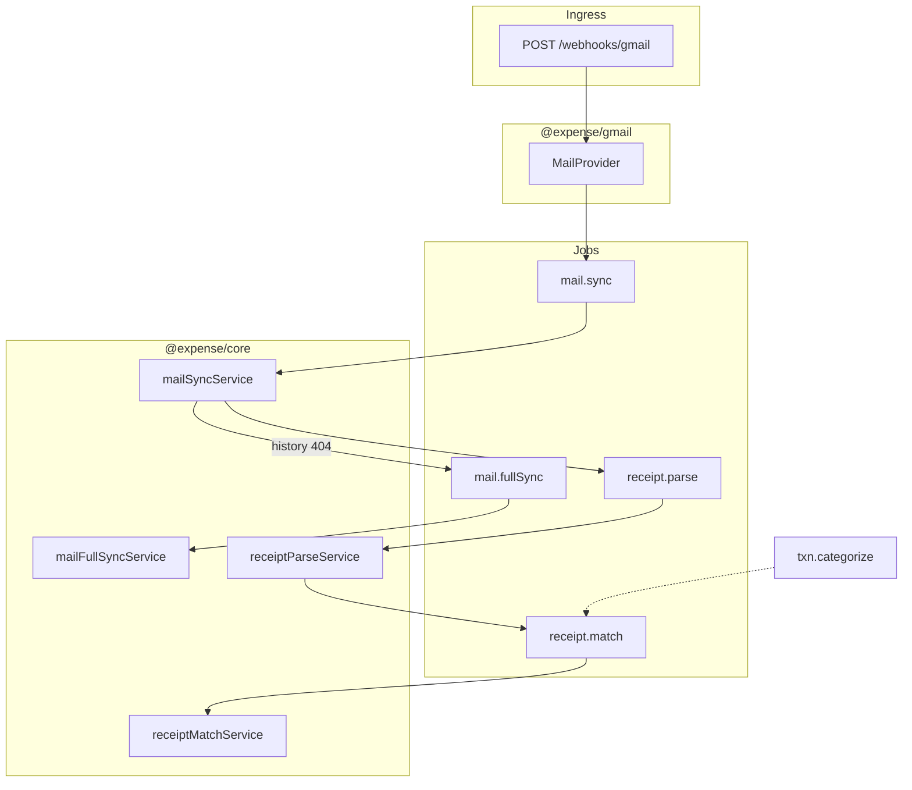

# Gmail Receipt Enrichment

> **Status:** Approved design spec — implement phases G1→G10 in order.  
> **Product:** Gmail is **core onboarding**, not optional. Plaid = canonical spend; Gmail = order context (links, line items, narrative).  
> **Pattern:** Parallel to Plaid — separate port, adapter, webhook, jobs, merge in domain.  
> **API review:** Section 3.1 verified against Gmail + Pub/Sub docs (2026-05).

---

## 1. Product intent

The CFO agent is more than a transaction aggregator. Users connect **bank (Plaid)** and **Gmail** during onboarding. The system:

1. Ingests card charges from Plaid (source of truth for spend).
2. Ingests order/receipt emails from Gmail (source of truth for *what the charge was*).
3. Matches receipts to transactions where confident.
4. Surfaces **unmatched** items honestly (with reasons and “maybe this charge” candidates).
5. Produces **weekly digests** and **monthly expense reports** from structured facts — not by re-reading Gmail at send time.

---

## 2. Locked decisions

| Topic | Decision |
|-------|----------|
| Gmail optional? | **No** — core onboarding alongside Plaid. Handle revoke gracefully. |
| Port separation | **Always separate:** `MailProvider`, `ReceiptExtractor`, repos, services. |
| Raw email storage | **Parse once.** Persist structured `Receipt` + `MailMessage` metadata long-term. Raw body: fetch during parse; delete after success; TTL 14 days on parse failure only. |
| Unmatched receipts | **Always show** in digest/monthly report with reason + top 1–2 “maybe this” candidates below auto-link threshold. |
| Bank card alert emails | **Exclude** — redundant with Plaid; classifier ignores them. |
| Fake Gmail | **`makeFakeMailProvider()` for tests only.** Real `makeGmailMailProvider()` in dev/staging/prod from day one. |
| Monthly report window | **Calendar month in user timezone** (e.g. May 1 00:00 → May 31 23:59:59). |
| Auto-link threshold | Configurable `mail.match.minScore` (default 70). Never link two receipts to one transaction. |

---

## 3. Architecture (parallel to Plaid)

```
Connect (OAuth)          Push (Pub/Sub)              Workers
─────────────────        ───────────────           ─────────────────────────
GET /api/gmail/connect   POST /webhooks/gmail        mail.sync ──404──► mail.fullSync
GET /api/gmail/callback  OIDC verify → enqueue       receipt.parse
                         mail.sync                   receipt.match
Scheduler: mail.watch (renew users.watch daily)
```

**Not in Plaid handler.** Same *pattern*, different route + port + jobs.



### 3.1 Gmail API verified behavior & caveats

Cross-checked against [Gmail push](https://developers.google.com/workspace/gmail/api/guides/push), [history.list](https://developers.google.com/gmail/api/reference/rest/v1/users.history/list), [users.watch](https://developers.google.com/gmail/api/reference/rest/v1/users.watch), and [Pub/Sub push auth](https://cloud.google.com/pubsub/docs/authenticate-push-subscriptions).

| Topic | Verified behavior | Implication for us |
|-------|-------------------|-------------------|
| Push payload | Pub/Sub `message.data` (Base64URL) decodes to `{ emailAddress, historyId }` only | No bodies in webhook; always enqueue sync |
| Push `historyId` | New mailbox checkpoint (end state), **not** `startHistoryId` | `mailSyncService` reads cursor from `MailAccount.historyId`; push value is optional hint only |
| `history.list` | Returns `messagesAdded`, `messagesDeleted`, `labelsAdded`, `labelsRemoved` | Adapter must surface label events (receipt moved into INBOX) |
| History expiry | Invalid `startHistoryId` → HTTP **404**; history “typically ≥1 week” | Fall back to `mail.fullSync` (see §8) |
| Notification rate | Max ~**1 event/sec per user**; excess dropped | Coalesce sync jobs per account; don’t rely on every push |
| `users.watch` | Must renew within **7 days**; Google recommends daily | Scheduler `mail.watch` daily |
| Quota | `history.list` = 2 units; `messages.get` = **20 units** regardless of `format` | Funnel saves bytes/parsing, not quota on get |
| INBOX watch | `labelIds: ["INBOX"]` + `INCLUDE` only notifies INBOX changes | Receipts in Promotions/Updates may be missed — see §11.2 `fullSyncBackfillDays` |
| Webhook auth | **Pub/Sub OIDC JWT** in `Authorization` header + decode body | **Not** Plaid-style body JWT (§9) |
| OAuth | Refresh token needs `access_type=offline`; first connect needs `prompt=consent` | `createAuthUrl` must set both when no stored token |
| Timestamps | `internalDate` (epoch ms) more reliable than RFC `Date` header | Map `MailMessage.receivedAt` from `internalDate` |
| Disconnect | `users.stop` + Google token revoke | `MailProvider.stopMailbox` + `revokeAccess` (§6.1) |

---

## 4. Ingest funnel (smart pull)

Only fetch what we need:

| Stage | API | Quota / payload | Action |
|-------|-----|-----------------|--------|
| 0 | Push notification | Free | `emailAddress` + `historyId` only (decode Pub/Sub `message.data`) |
| 1 | `history.list` | **2** units | Collect candidate message IDs from all change types (§6.1) |
| 2 | `messages.get` `format=metadata` | **20** units; small JSON | `From`, `Subject`, `internalDate` → `receivedAt`; optional `snippet` with `gmail.readonly` |
| 3 | Pure classifiers | CPU | Ignore marketing, bank alerts; classify kind |
| 4 | `messages.get` `format=full` | **20** units; large MIME tree | Body for survivors only (no attachments v1); adapter walks `payload.parts` |
| 5 | `ReceiptExtractor` | LLM/heuristic | Structured `Receipt` |
| 6 | `receiptMatchService` | DB | Link or mark unmatched |

Skip if `gmailMessageId` already in DB (idempotent).

**Full sync path** (when `history.list` returns 404): `messages.list` with receipt-oriented `q` filter over `mail.fullSync.backfillDays`, then stages 2–6 per message. See job `mail.fullSync` in §8.

---

## 5. Domain model

### 5.1 IDs (branded, uuidv7)

- `MailAccountId`
- `MailMessageId`
- `ReceiptId`

### 5.2 `MailAccount` (connection — mirrors `PlaidItem`)

```ts
interface MailAccount {
  readonly id: MailAccountId;
  readonly userId: UserId;
  readonly gmailAddress: string;
  readonly status: "active" | "needs_reauth" | "revoked" | "error";
  readonly historyId: string | null;   // last successfully processed history checkpoint (startHistoryId for next sync)
  readonly watchExpiresAt: Date | null;
  readonly lastSyncedAt: Date | null;
  readonly connectedAt: Date;
}
```

Refresh token encrypted via `Crypto` port. Repo: `withRefreshToken(id, fn)`.

### 5.3 `MailMessage` (audit + idempotency, not full inbox mirror)

```ts
type MailProcessingStatus =
  | "seen" | "ignored" | "classified" | "parsed" | "parse_failed" | "matched" | "deleted";

interface MailMessage {
  readonly id: MailMessageId;
  readonly userId: UserId;
  readonly mailAccountId: MailAccountId;
  readonly gmailMessageId: string;   // unique per mail account; immutable Gmail id
  readonly threadId: string;
  readonly receivedAt: Date;          // from Gmail internalDate (UTC), not RFC Date header
  readonly fromAddress: string;
  readonly fromDomain: string;
  readonly subject: string;
  readonly processingStatus: MailProcessingStatus;
  readonly ignoreReason: string | null;
  readonly receiptKind: ReceiptKind | null;
}
```

### 5.4 `ReceiptKind` (closed enum — classifier registry keys)

| Kind | Match to Plaid? |
|------|-----------------|
| `order_confirmation` | Yes |
| `food_delivery` | Yes |
| `rideshare` | Yes |
| `subscription_renewal` | Yes |
| `refund` | Yes |
| `invoice_bill` | Yes |
| `travel_booking` | Yes |
| `event_ticket` | Yes |
| `shipping_update` | Sometimes (tracking URL) |
| `marketplace_payment` | Careful |
| `peer_transfer` | Usually no |
| `marketing` | **Exclude** |
| `bank_card_alert` | **Exclude** |
| `unknown` | LLM fallback |

### 5.5 `Receipt` (long-lived structured artifact)

```ts
interface ReceiptLineItem {
  readonly description: string;
  readonly quantity: number | null;
  readonly amount: Money | null;
}

interface Receipt {
  readonly id: ReceiptId;
  readonly userId: UserId;
  readonly mailMessageId: MailMessageId;
  readonly kind: ReceiptKind;
  readonly merchantName: string;
  readonly merchantDomain: string | null;
  readonly orderId: string | null;
  readonly orderUrl: string | null;
  readonly totalAmount: Money | null;
  readonly occurredAt: Date | null;
  readonly lineItems: readonly ReceiptLineItem[];
  readonly extractedAt: Date;
  readonly extractionSource: "heuristic" | "llm";
  readonly confidence: number;
}
```

### 5.6 `TransactionReceiptLink`

```ts
interface TransactionReceiptLink {
  readonly userId: UserId;
  readonly transactionId: TransactionId;
  readonly receiptId: ReceiptId;
  readonly matchScore: number;
  readonly matchReason: string;
  readonly linkedAt: Date;
}
```

### 5.7 Unmatched reporting

```ts
type UnmatchReason =
  | "no_bank_activity"
  | "amount_mismatch"
  | "date_out_of_range"
  | "merchant_unclear"
  | "low_parse_confidence"
  | "multiple_candidates";

interface UnmatchedReceiptFact {
  readonly merchantName: string;
  readonly amount: string | null;
  readonly receivedAt: string;
  readonly kind: ReceiptKind;
  readonly reason: UnmatchReason;
  readonly reasonDetail: string;
  readonly maybeTransactions: ReadonlyArray<{
    readonly merchantName: string;
    readonly amount: string;
    readonly occurredAt: string;
    readonly score: number;
    readonly whyNot: string;
  }>;
}
```

Reverse case in reports: shopping-category transactions with no receipt → *“No order email found for this charge.”*

---

## 6. Ports (`packages/core/src/ports/`)

### 6.1 `MailProvider` — `@expense/gmail`

```ts
interface VerifiedMailPush {
  readonly gmailAddress: string;
  readonly historyId: string; // new mailbox checkpoint from notification — not startHistoryId
}

interface RawMailMetadata {
  readonly gmailMessageId: string;
  readonly threadId: string;
  readonly receivedAt: Date;       // mapped from internalDate
  readonly fromAddress: string;
  readonly subject: string;
  readonly snippet: string | null; // may be present with gmail.readonly; do not require for classify
  readonly labelIds: readonly string[];
}

interface RawMailBody {
  readonly gmailMessageId: string;
  readonly textPlain: string | null; // adapter walks MIME tree (multipart/alternative, etc.)
  readonly textHtml: string | null;
}

/** One page of history.list — adapter normalizes all change types into candidate IDs. */
interface MailChangePage {
  readonly candidateMessageIds: readonly string[]; // deduped ids worth metadata fetch
  readonly deletedMessageIds: readonly string[];
  readonly nextHistoryId: string;                  // persist as MailAccount.historyId when sync completes
}

interface MailListPage {
  readonly messageIds: readonly string[];
  readonly nextPageToken: string | null;
}

interface MailProvider {
  createAuthUrl(input: {
    userId: UserId;
    redirectUri: string;
    /** true on first connect or when refresh token missing — forces consent + offline token */
    forceConsent?: boolean;
  }): Promise<{ url: string }>;

  exchangeAuthCode(input: { code: string; redirectUri: string }): Promise<{
    gmailAddress: string; // from users.getProfile after token exchange
    refreshToken: string;
  }>;

  watchMailbox(input: {
    refreshToken: string;
    topicName: string;
    labelIds?: readonly string[];
    labelFilterBehavior?: "INCLUDE" | "EXCLUDE";
  }): Promise<{ historyId: string; expiration: Date }>;

  stopMailbox(input: { refreshToken: string }): Promise<void>; // users.stop

  revokeAccess(input: { refreshToken: string }): Promise<void>; // Google revoke endpoint

  /** Verify Pub/Sub push: OIDC JWT in Authorization + Base64URL-decode message.data. */
  verifyPushNotification(headers: Record<string, string>, rawBody: Buffer): Promise<VerifiedMailPush>;

  listChanges(input: { refreshToken: string; startHistoryId: string; labelId?: string }): Promise<MailChangePage>;

  /** Used when history.list returns 404 (expired checkpoint). */
  listRecentMessageIds(input: {
    refreshToken: string;
    query: string;
    maxResults?: number;
    pageToken?: string;
  }): Promise<MailListPage>;

  getMessageMetadata(input: { refreshToken: string; gmailMessageId: string }): Promise<RawMailMetadata>;
  getMessageBody(input: { refreshToken: string; gmailMessageId: string }): Promise<RawMailBody>;
}
```

Factory: `makeGmailMailProvider(cfg)` in `packages/gmail`.  
Fake: `makeFakeMailProvider()` in `@expense/core/testing`.

**OAuth URL contract:** `createAuthUrl` must request scope `https://www.googleapis.com/auth/gmail.readonly`, `access_type=offline`, and `prompt=consent` when `forceConsent` is true.

### 6.2 `ReceiptExtractor` — `@expense/llm` (separate from `LlmProvider`)

```ts
interface ReceiptExtractor {
  extract(input: ReceiptExtractionInput): Promise<ReceiptExtractionResult>;
}
```

Factory: `makeClaudeReceiptExtractor(cfg)`. Fake: `makeFakeReceiptExtractor()`.

Validate extracted amounts with same money rules as digest (no invented totals).

### 6.3 Repository ports

- `MailAccountRepository`
- `MailMessageRepository`
- `ReceiptRepository`
- `TransactionReceiptLinkRepository`

Add to `Repositories` bag. Every query scoped by `userId`.

Full signatures → implement in [interfaces.md](./interfaces.md) when G2 starts.

---

## 7. Domain services

| Service | Job | Responsibility |
|---------|-----|----------------|
| `mailSyncService` | `mail.sync` | Delta sync via `history.list`; on 404 enqueue `mail.fullSync` |
| `mailFullSyncService` | `mail.fullSync` | Backfill via `messages.list` when history checkpoint expired |
| `receiptParseService` | `receipt.parse` | fetch body → extract → persist Receipt → enqueue match |
| `receiptMatchService` | `receipt.match` | score candidates → link or record unmatched facts |

### `mailSyncService` cursor semantics

1. Load `MailAccount.historyId` as `startHistoryId` (null on first sync → use `historyId` from last `watchMailbox` response stored at connect).
2. Call `listChanges({ startHistoryId })`, paginating until no `nextPageToken`.
3. For each `candidateMessageId`, skip if `gmailMessageId` already in DB; else metadata → classify → maybe enqueue `receipt.parse`.
4. Mark `deletedMessageIds` as `MailMessage.processingStatus = "deleted"` (or skip if never seen).
5. Persist **`nextHistoryId` from the final history page** as `MailAccount.historyId` — not the push notification value (push is a wake-up, not the cursor).
6. On **`history.list` 404**: enqueue `mail.fullSync` for the account; do not advance cursor until full sync completes.

**Classifier registry** (pure, like anomaly detectors): `blocklist-marketing`, `blocklist-bank-alert`, domain classifiers, optional LLM fallback.

**Match scorer** (pure): weighted signals — amount, date window, merchant fuzzy, order id in memo, category bonus. Config in YAML.

**Hook in `categorizeService`:** after enrich, if category ∈ `mail.categoriesTriggerMatch`, enqueue `receipt.match { transactionId }`.

---

## 8. Jobs

Extend `JobName` in `packages/core/src/ports/jobs.ts` and `packages/queue/src/jobs.ts`:

| Job | Payload | Enqueued by | Idempotency `jobId` |
|-----|---------|-------------|---------------------|
| `mail.sync` | `{ userId, mailAccountId }` | Gmail webhook, OAuth callback, coalesced retries | `mail.sync:{mailAccountId}` — **one active sync per account** |
| `mail.fullSync` | `{ userId, mailAccountId }` | `mail.sync` on history 404 | `mail.fullSync:{mailAccountId}` |
| `mail.watch` | `{ userId, mailAccountId }` | Scheduler daily | `mail.watch:{mailAccountId}:{date}` |
| `receipt.parse` | `{ userId, mailMessageId }` | `mail.sync`, `mail.fullSync` | `receipt.parse:{gmailMessageId}` |
| `receipt.match` | `{ userId, receiptId?, transactionId? }` | parse, categorize | — |
| `report.generate` | `{ userId, yearMonth }` | Scheduler (1st of month) | `report:{userId}:{yearMonth}` |

**Coalescing:** Multiple Pub/Sub pushes for the same account while a sync is queued or running are deduped by `mail.sync:{mailAccountId}`. Message-level idempotency uses `gmailMessageId` in DB + `receipt.parse:{gmailMessageId}`.

Extend `delivery.send` kind: `"digest" | "anomaly" | "monthly_report"`.

---

## 9. API routes

| Route | Process | Role |
|-------|---------|------|
| `GET /api/gmail/connect` | API | OAuth redirect (`forceConsent` when no account or needs reauth) |
| `GET /api/gmail/callback` | API | Exchange code → create account → watch → enqueue `mail.sync` |
| `DELETE /api/gmail/disconnect` | API | `stopMailbox` + `revokeAccess` + mark account revoked |
| `GET /api/gmail/status` | API | Setup completeness |
| `POST /webhooks/gmail` | API | Pub/Sub push → verify JWT + decode → enqueue `mail.sync` |

### Webhook handler (Pub/Sub — not Plaid-shaped)

Gmail push arrives as a **Cloud Pub/Sub** HTTP POST. Two verification steps:

1. **Transport auth (recommended):** Verify OIDC JWT in `Authorization: Bearer …` — audience must match push subscription config (`GMAIL_PUBSUB_PUSH_AUDIENCE`), issuer Google, `email` claim matches push service account.
2. **Payload decode:** Parse JSON body → Base64URL-decode `message.data` → `{ emailAddress, historyId }`.

```ts
// 1. Adapter verifies Pub/Sub JWT + decodes Gmail notification
const verified = await container.mail.verifyPushNotification(headers, rawBody);

// 2. Lookup tenant — push historyId is NOT persisted here; worker uses account cursor
const account = await container.repos.mailAccounts.findByGmailAddress(verified.gmailAddress);
if (!account) throw new NotFoundError(...);

// 3. Coalesce: one sync job per account (worker reads MailAccount.historyId)
await container.producer.enqueue(
  "mail.sync",
  { userId: account.userId, mailAccountId: account.id },
  { jobId: `mail.sync:${account.id}` },
);

res.status(200).json({ ok: true }); // ack Pub/Sub
```

Unlike Plaid, there is no vendor JWT signing the raw body. Reuse the *enqueue-only* pattern from `routes/webhooks.ts`, not the verification implementation.

---

## 10. Wiring

| Process | Needs |
|---------|--------|
| `buildApiContainer` | `MailProvider`, repos, producer |
| `buildWorkerContainer` | `MailProvider`, `ReceiptExtractor`, mail + receipt services |
| `buildSchedulerContainer` | producer; enqueue `mail.watch` + `report.generate` |

Add to `@expense/wiring`: `resolveMail()`, `resolveReceiptExtractor()`, `buildReceiptServices()`.

---

## 11. Config

### 11.1 Secrets (`.env`)

```env
GOOGLE_CLIENT_ID=
GOOGLE_CLIENT_SECRET=
GOOGLE_OAUTH_REDIRECT_URI=
GMAIL_PUBSUB_TOPIC=projects/.../topics/gmail-push
GMAIL_PUBSUB_PUSH_AUDIENCE=https://<api-host>/webhooks/gmail
# GMAIL_FAKE only for test env injection — not for end users
```

### 11.2 Tunables (`config/default.yaml`)

```yaml
mail:
  inboxLabelIds: ["INBOX"]
  labelFilterBehavior: "INCLUDE"   # users.watch — only INBOX-tagged changes notify
  fullSyncBackfillDays: 30         # messages.list window when history.list 404
  fullSyncQuery: "category:updates OR category:purchases OR subject:(order OR receipt OR invoice)"
  classifier:
    minConfidence: 0.75
    llmFallback: true
    blockBankCardAlerts: true
  retention:
    failedParseBodyDays: 14
  match:
    windowDays: 5
    amountToleranceMinorUnits: 100
    minScore: 70
    weights: { exactAmount: 40, nearAmount: 25, sameDay: 25, nearDay: 15, merchantFuzzy: 20, orderIdInMemo: 15, categoryBonus: 10 }
  categoriesTriggerMatch:
    - shopping
    - subscriptions
    - dining
    - travel
    - entertainment

report:
  monthlyDay: 1              # enqueue on 1st of month, user timezone
  deliveryHour: 9            # local hour

workers:
  concurrency:
    mail.sync: 2
    mail.fullSync: 1
    mail.watch: 1
    receipt.parse: 2
    receipt.match: 2
    report.generate: 1
```

**INBOX-only watch tradeoff:** Many merchants deliver to Promotions/Updates tabs. `fullSyncBackfillDays` + `mail.fullSync` on history 404 mitigates missed pushes. v1 accepts this gap; widen `inboxLabelIds` or remove label filter if match rate is too low in beta.

Mappers: `toMailConfig(app)`, `toReceiptMatchConfig(app)`, `toReportConfig(app)`.

---

## 12. Database (Prisma)

New tables: `mail_accounts`, `mail_messages`, `receipts`, `transaction_receipt_links`.

See [code-map.md](./code-map.md) — update when G4 lands.

Relations:

- `User` → many `MailAccount`
- `MailMessage` → optional one `Receipt`
- `Transaction` → optional one `TransactionReceiptLink` → `Receipt`

**Constraints:**

- `mail_messages (mail_account_id, gmail_message_id)` unique
- `transaction_receipt_links (user_id, transaction_id)` unique — one receipt per transaction
- `transaction_receipt_links (user_id, receipt_id)` unique — one transaction per receipt

---

## 13. Packages & files (build checklist)

| Package / app | New / changed |
|---------------|---------------|
| `packages/core` | domain types, ports, classifiers, match scorer, 4 services, report facts |
| `packages/gmail` | **new** — `makeGmailMailProvider` |
| `packages/llm` | `makeClaudeReceiptExtractor` |
| `packages/db` | schema + 4 repos |
| `packages/queue` | 6 job schemas (`mail.fullSync` included) |
| `packages/config` | env + YAML + mappers |
| `packages/wiring` | resolveMail, receipt services |
| `apps/api` | gmail routes + webhook |
| `apps/workers` | job handler lines |
| `apps/scheduler` | mail.watch + report.generate tick |
| `apps/web` | Connect Gmail in onboarding |

---

## 14. Google Cloud (real product — not deferred)

Required for production path from first merge of `@expense/gmail`:

1. GCP project with Gmail API + Pub/Sub enabled.
2. OAuth consent screen + `gmail.readonly` scope (restricted). Request `access_type=offline` on connect.
3. Pub/Sub topic; grant `gmail-api-push@system.gserviceaccount.com` **Publisher** on topic.
4. Push subscription → `https://<api>/webhooks/gmail` with **OIDC push auth** enabled; set audience = `GMAIL_PUBSUB_PUSH_AUDIENCE`.
5. **`users.watch` renewal** at least every 7 days (scheduler `mail.watch` daily).

**Verification:** Public launch requires Google OAuth verification + CASA security assessment for restricted scopes. Develop with test users on consent screen while verification runs in parallel.

---

## 15. Testing strategy

| Level | What |
|-------|------|
| L1 | Classifiers, match scorer, unmatch reason copy (pure) |
| L2 | Services with `makeFakeMailProvider` + fake extractor + in-memory repos |
| L3 | Gmail adapter against Google test project; Postgres repos |
| L4 | e2e: fake push → mail.sync → parse → match → digest/report facts |
| L5 | Adapter: history 404 → mail.fullSync; labelAdded → candidate id |

**Scenario catalog:** `packages/core/src/testing/receipt-scenarios.ts` — eight
declarative cases. Run via `mail-receipt-scenarios.test.ts` on every `npm test`.

**L4 e2e:** `apps/api/e2e/gmail-to-digest.e2e.ts` (in-memory) and
`gmail-to-digest-full.e2e.ts` (Postgres + BullMQ) — POST `/webhooks/gmail` through
workers to digest facts with matched/unmatched receipt sections.

Fake mail provider is **CI only**. Integration tests may use real Google sandbox credentials when present (gated).

---

## 16. Out of scope v1

- PDF/image attachment parsing
- Gmail filter/label automation (scope creep)
- Multiple mailboxes per user (schema allows; ship one)
- Bank alert emails
- Gmail as spend source of truth

---

## 17. Implementation phases

Execute in order. **Red → green → refactor** each phase before the next.

| Phase | Deliverable | DoD |
|-------|-------------|-----|
| **G0** | This doc approved | ✓ |
| **G1** | Domain types, `ReceiptKind`, classifiers, match scorer, unmatch reasons — pure tests | ✓ `npm test` green |
| **G2** | Port interfaces + fakes + contract tests | ✓ Fakes pass contract suite |
| **G3** | Job types, 4 services, in-memory e2e heartbeat | ✓ Push → parse → match; history 404 → fullSync |
| **G4** | Prisma migration + repos + repo contract tests | ✓ Integration green |
| **G5** | `@expense/gmail` real adapter + OAuth routes | ✓ Manual connect in dev; MIME body walk |
| **G6** | Pub/Sub webhook (OIDC verify) + `mail.watch` scheduler | ✓ Push triggers sync; workers consume mail jobs |
| **G7** | Claude receipt extractor + parse validation | Parse quality on fixture emails |
| **G8** | DigestFacts + monthly `MonthlyReportFacts` enrichment | Unmatched section in output |
| **G9** | `report.generate` + email template + scheduler | Monthly email sends |
| **G10** | Web onboarding (Gmail + bank required) | Setup gate in UI |

**Parallel track (ops):** Google Cloud setup + OAuth verification paperwork during G5–G6.

---

## 18. Doc updates when implementing

When each phase lands, update:

- [interfaces.md](./interfaces.md) — full port contracts
- [domain-model.md](./domain-model.md) — new entities
- [code-map.md](./code-map.md) — new files
- [README.md](../README.md) — onboarding + architecture diagram

---

## 19. References

- [Gmail push notifications (Pub/Sub)](https://developers.google.com/workspace/gmail/api/guides/push)
- [Synchronize clients (full vs partial sync)](https://developers.google.com/gmail/api/guides/sync)
- [history.list](https://developers.google.com/gmail/api/reference/rest/v1/users.history/list)
- [messages.get / Format](https://developers.google.com/workspace/gmail/api/reference/rest/v1/Format)
- [Gmail API scopes](https://developers.google.com/workspace/gmail/api/auth/scopes)
- [Pub/Sub push authentication](https://cloud.google.com/pubsub/docs/authenticate-push-subscriptions)
- [Restricted scope verification](https://developers.google.com/identity/protocols/oauth2/production-readiness/restricted-scope-verification)
- [factories-and-composition.md](./patterns/factories-and-composition.md)
- [registries-and-dispatch.md](./patterns/registries-and-dispatch.md)
